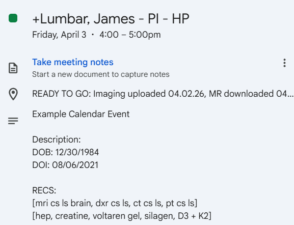
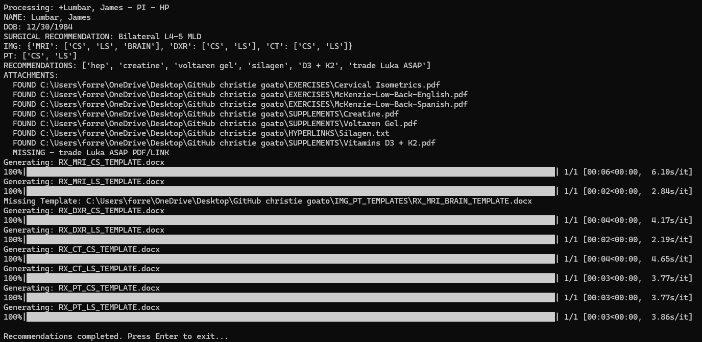
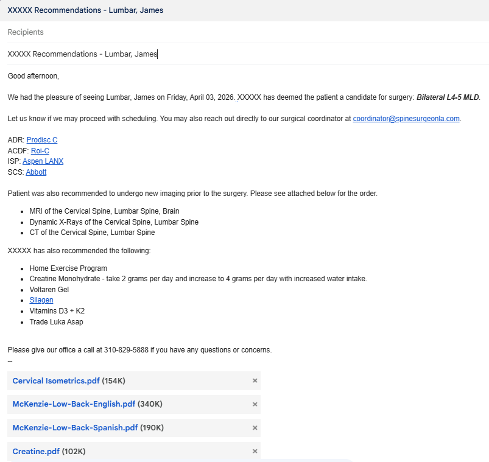

# Christie Goato

## Overview

This script automates a real-world clinical workflow by converting structured Google Calendar event data (clinical patient recommendation data) into usable outputs. 

This system was designed to operate in a non-technical environment. It was originally packaged as an executable and run on computers without Python installed. Several design decisions were made to ensure that the system could be used, maintained, and extended by users with minimal to no programming experience.

## Core Functionality

- Pulls data from Google Calendar events
- Parses event data inputs 
- Generates Word document and converts document to PDF
- Generates Gmail draft 
- Finds matching input data to dynamically attach resources

## Key Features:

### Google Calendar Input Layer
- Staff already use Google Calendar to easily visualize patient updates
- Avoids building and introducing new interface and new training
  
### Flexible Parsing Logic for Real-World Input Handling
- Supports case-insensitive input
- Customizable shorthand and shorthand grouping logic ("MRI cs ls" is interpreted as a recommendation to get an MRI of the Cervical and Lumbar Spine)

### Configuration and Resources Externalized from Logic
- Operational resources can be added or modified without rebuild or redeployment of application
- Extensibility: allows the system to evolve with new clinical practices
- Minimizes need for direct interaction with code
  
### Real Time Error Logging and Detection
- Each event is processed individually with errors logged to each event
- Easy to visualize and identify failures in retrieving event data, parsing event data, missing resources, document generation, email drafting, etc
- Designed for maintainability

### Automation of Multiple Downstream Outputs from One Single Source
- A single structured calendar event is able to produce multiple Word documents, PDFs, and a Gmail draft with respective attachments and hyperlinks.
- Delivers End-to-End workflow automation through integration of external APIs, local resource management, and document templating/generation in a single system.

## Prerequisites

### System Requirements
Python 3.10+ (developed and tested on 3.11)
Windows OS
Microsoft Word (required for PDF conversion)
Google account with API access enabled

### Required Files

The following must exist in the project root:

- credentialsCS2.json (Google OAuth client credentials)
- token.pickle
- token_calendar.pickle
- token_gmail.pickle
- IMG_PT_TEMPLATES/
- EXERCISES/
- SUPPLEMENTS/
- HYPERLINKS/

Full Project Structure: 
```
.
├── main.py
├── app_config.py
├── google_auth.py
├── google_calendar_events_pull.py
├── event_parser.py
├── document_generator.py
├── create_gmail_draft.py
├── command_line_interface.py
├── utils.py
├── settings.json
├── recommendations.json
├── requirements.txt
├── IMG_PT_TEMPLATES/
├── EXERCISES/
├── SUPPLEMENTS/
├── HYPERLINKS/
└── OUTPUT/
```

## Usage
### 1. Create or Update Google Calendar:

#### Event Title Format
```
Last, First
```
- Must be `Last, First` format with a comma and space between names
- Apostrophes are supported: `O'Brien, James`
- A `+` prefix is allowed and ignored: `+Smith, John`
- If the title does not match this pattern, the raw title is used as the patient name

### 2. Add Structured Data into Event Description:

  Example Description: 

  

#### Event Description Format

The description must contain `RECS:` — events without it are skipped.

**REGEX:**
```
DOB: MM/DD/YYYY
RECS:
```
`DOB` accepts `DOB: MM/DD/YYYY` or `DOB MM/DD/YYYY` — the colon is optional.

#### Bracket Blocks `[ ]`

Everything inside square brackets is parsed. Brackets hold imaging orders, PT orders, and recommendations. They can be mixed in the same bracket or split across separate ones. 

**Imaging** — Imaging type first, then regions:
```
[MRI CS] = MRI of the Cervical Spine
[CT LS] = CT of the Lumbar Spine
[DXR CS LS] = Dynamic X-Rays of the Cervical Spine and Lumbar Spine
[MRI CS, CT LS] = MRI of the Cervical Spine and CT of the Lumbar Spine
```

**Physical Therapy** — `PT` followed by regions:
```
[PT CS]
[PT LS]
[PT CS LS]
```

**Recommendations** — any token that does not start with `MRI`, `CT`, `DXR`, or `PT` followed by a space:
```
[HEP]
[Vitamin D]
[HEP, Fish Oil, Vitamin D, patient needs referral to neuropsychiatry]
```

**Mixed bracket** — all valid in one block:
```
[MRI CS LS, PT CS, HEP, Vitamin D]
```

#### Region and Imaging Codes

Note: Codes are Case Insensitive

| Code | Region |
|---|---|
| `CS` | Cervical Spine |
| `TS` | Thoracic Spine |
| `LS` | Lumbar Spine |
| `BRAIN` | Brain |

| Code | Imaging |
|---|---|
| `MRI` | MRI |
| `CT` | CT |
| `DXR` | Dynamic X-Rays |

#### Surgical Patients
Wrap the procedure name in curly braces anywhere in the description:
```
{L4-L5 Microdiscectomy}
```
This triggers the surgical email template and adds the coordinator to CC.

#### Non-Surgical Example
```
DOB: 04/15/1978
RECS:

[MRI CS LS, PT CS LS, HEP, Vitamin D]
```

#### Surgical Example
```
DOB: 04/15/1978
RECS:

{L4-L5 Microdiscectomy}
[DXR CS LS, HEP]
```

### 3. Running the Script:
  For each event:
  - Checks for "RECS:", and if found
  - Extracts patient name, date of birth, and recommendations
  - Generates Word documents from templates inside template folder
  - Converts generated Word documents to PDF
  - Searches local folders for matching PDFs and hyperlinks
  - Creates Gmail draft with formatted recommendations and attachments

### PDF Attachments:
The script searches SUPPLEMENTS/ and EXERCISES/ for matching file names. If a matching file is found, it is attached to the email.

### Hyperlinks:
The script searches HYPERLINKS/ for a matching .txt file name. If a matching file is found, the exact string of text found within the .txt file will be inserted as a hyperlink.

### Terminal Output:
During execution, the terminal displays
- Parsed patient information
- Detected recommendations sorted into categories
- Real time document generation tracking
- Found/Missing Attachments/Hyperlinks

Example Terminal Output:



### OUTPUT Folder:
Generated files will be saved in the root OUTPUT folder.
Example format:
```
OUTPUT/
└── Lumbar, James/
    ├── RX MRI CS 04.13.26.docx
    ├── RX MRI CS 04.03.26.pdf
    ├── RX PT LS 04.03.26.docx
    ├── RX PT LS 04.03.26.pdf
```

### Example Gmail Draft:
 

### Updating the System Externally
 
#### settings.json — Clinic-Wide Configuration
No code changes needed for any of these. Edit the value, save, run.

  Change clinic info

    "clinic_name": "Dr. Smith",
    "phone": "310-555-1234",
    "welcome_email": "welcome@newclinic.com"

  Change the email subject line

    "subject_prefix": "Dr. Smith Recommendations"
  
  Change PT schedule wording

    "pt_schedule": "three times a week for 4 weeks"
    
  Change the closing message — {phone} is automatically replaced with the phone number above

    "closing_message": "Contact our office at {phone} with any questions."
    
  Change the imaging note that appears when PT and imaging are both ordered

    "pt_imaging_note": "All imaging must be completed after physical therapy."

  Add a new region — add to all three region blocks (sort order: priority is lowest number (highest priority) to highest number (lowest priority))

    "region_display_names": {
        "CS": "Cervical Spine",
        "TS": "Thoracic Spine",
        "LS": "Lumbar Spine",
        "BRAIN": "Brain",
        "HIP": "Hip"
    },
    "region_sort_order": {
        "CS": 0,
        "TS": 1,
        "LS": 2,
        "BRAIN": 3,
        "HIP": 4
    }
  
  Change how an imaging type displays in the email

    "imaging_display_names": {
        "MRI": "Magnetic Resonance Imaging (MRI)",
        "CT": "CT Scan",
        "DXR": "Dynamic X-Rays"
    }

#### recommendations.json — Recommendation Specific Configuration

  The key is the bracket keyword used in the calendar event (e.g. [CREATINE]). Keys in are case-insensitive. [creatine], [CREATINE], [CrEaTiNe] in the event all resolve to the "CREATINE" key in the JSON.

  Add a new supplement with a PDF in the SUPPLEMENTS folder

    "MAGNESIUM": {
        "display": "Magnesium Glycinate",
        "type": "pdf_or_link",
        "pdf_name": "Magnesium"
    }
  The script looks for a file named Magnesium (any extension) in the SUPPLEMENTS folder and attaches it.

  Add a new recommendation that only has a hyperlink (no PDF)

    "CPAP": {
        "display": "CPAP Therapy",
        "type": "link_or_plain"
    }

  The script looks for a file named CPAP in the HYPERLINKS folder containing the URL. If not found, renders as plain text.

  Add a new exercise bundle — attaches multiple PDFs from the EXERCISES folder

    "CORE": {
        "display": "Core Strengthening Program",
        "type": "exercise_bundle",
        "exercise_files": [
            "Core Exercise 1.pdf",
            "Core Exercise 2.pdf"
        ]
    }

  Change the display text of an existing recommendation

    "CREATINE": {
        "display": "Creatine Monohydrate 2–4g daily with increased water intake.",
        "type": "pdf_or_link",
        "pdf_name": "Creatine"
    }

#### Simplified Updating Attachments / Templates: 
  In the case that you do not need to change the key from the display name, use this simplified version.
  
  Add a New PDF
  
    1. Place the file in EXERCISES/ or SUPPLEMENTS/
    2. Match the filename to the recommendation name

  Add a New Hyperlink
  
    1. Create a .txt file in HYPERLINKS/
    2. Put the URL inside

  Add a New Imaging or PT Template
  
    1. Add a .docx file to IMG_PT_TEMPLATES/
    2. Include placeholders such as:
      {$NAME}
      {$DOB}
      {$DATE}

## About Me
I am Forrest. I currently work as a medical scribe and medical assistant. I believe the evolution of technology will play a major role in the future of medicine. Too often, physicians are limited in how much meaningful clinical work they can do because so much of their time is consumed by documentation, coordination, and other repetitive administrative tasks. As an aspiring physician, I want to help minimize that burden. To that end, I have spent much of my free time learning to develop practical tools that can help alleviate burnout from administrative busywork and allow healthcare professionals to devote more time and attention to where it matters most: with patients.

It is incredibly frustrating when useful programs do not naturally connect or communicate with one another. In healthcare especially, important information is often trapped across separate systems, which creates extra work, delays, and unnecessary friction. I have noticed that although many programs may be highly optimized for efficiency in isolation, much of the real inefficiency comes from the gaps between them and the time lost navigating systems that do not work well together. In the same way that a doctor should be well connected to their patients, I believe the tools that support care should be well connected to each other. This program is my first contribution in helping bridging those gaps.
